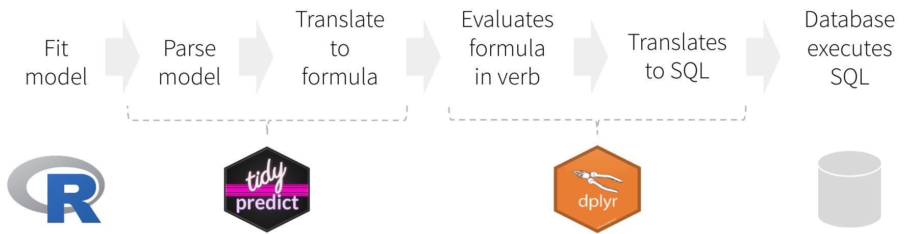

# tidypredict <a href="https://tidypredict.tidymodels.org"></a>

[](https://github.com/tidymodels/tidypredict/actions/workflows/R-CMD-check.yaml)
[](https://CRAN.R-project.org/package=tidypredict)
[](https://CRAN.R-project.org/package=tidypredict)
[](https://app.codecov.io/gh/tidymodels/tidypredict)
[](https://lifecycle.r-lib.org/articles/stages.html)

```{r pre, include = FALSE}
if (!rlang::is_installed("randomForest")) {
  knitr::opts_chunk$set(
    eval = FALSE
  )
}
```

```{r setup, include=FALSE}
library(dplyr)
library(tidypredict)
library(randomForest)
```


The main goal of `tidypredict` is to enable running predictions inside databases. It reads the model, extracts the components needed to calculate the prediction, and then creates an R formula that can be translated into SQL. In other words, it is able to parse a model such as this one:

```{r}
model <- lm(mpg ~ wt + cyl, data = mtcars)
```

`tidypredict` can return a SQL statement that is ready to run inside the database.  Because it uses `dplyr`'s database interface, it works with several databases back-ends, such as MS SQL:

```{r}
tidypredict_sql(model, dbplyr::simulate_mssql())
```


## Installation

Install `tidypredict` from CRAN using:
```{r, eval = FALSE}
install.packages("tidypredict")
```

Or install the **development version** using `devtools` as follows:
```{r, eval = FALSE}
install.packages("remotes")
remotes::install_github("tidymodels/tidypredict")
```

## Functions

`tidypredict` has only a few functions, and it is not expected that number to grow much.  The main focus at this time is to add more models to support. 

| Function                    | Description 
|-----------------------------|--------------------------------------------------------------------------------|
|`tidypredict_fit()`          | Returns an R formula that calculates the prediction                            |
|`tidypredict_sql()`          | Returns a SQL query based on the formula from `tidypredict_fit()`              |
|`tidypredict_to_column()`    | Adds a new column using the formula from `tidypredict_fit()`                   |
|`tidypredict_test()`         | Tests `tidypredict` predictions against the model's native `predict()` function  |
|`tidypredict_interval()`     | Same as `tidypredict_fit()` but for intervals (only works with `lm` and `glm`) |
|`tidypredict_sql_interval()` | Same as `tidypredict_sql()` but for intervals (only works with `lm` and `glm`) |
|`parse_model()`              | Creates a list spec based on the R model                                       |
|`as_parsed_model()`          | Prepares an object to be recognized as a parsed model                          |

## How it works



Instead of translating directly to a SQL statement, `tidypredict` creates an R formula. That formula can then be used inside `dplyr`.  The overall workflow would be as illustrated in the image above, and described here:

1. Fit the model using a base R model, or one from the packages listed in [Supported Models](#supported-models)
1. `tidypredict` reads model, and creates a list object with the necessary components to run predictions
1. `tidypredict` builds an R formula based on the list object
1. `dplyr` evaluates the formula created by `tidypredict`
1. `dplyr` translates the formula into a SQL statement, or any other interfaces.
1. The database executes the SQL statement(s) created by `dplyr`

### Parsed model spec

`tidypredict` writes and reads a spec based on a model.  Instead of simply writing the R formula directly, splitting the spec from the formula adds the following capabilities:

1. No more saving models as `.rds` - Specifically for cases when the model needs to be used for predictions in a Shiny app.
1. Beyond R models - Technically, anything that can write a proper spec, can be read into `tidypredict`. It also means, that the parsed model spec can become a good alternative to using *PMML.*

## Supported models

`tidypredict` parses 43 fitted model classes from 30 modeling packages. [Supported models](https://tidypredict.tidymodels.org/articles/models.html) has the full list, with the `parsnip` spec and engine for each and a link to a worked example. In brief:

- Regression: `lm()`, `glm()`, `glmnet::glmnet()`, `LiblineaR::LiblineaR()`, `quantreg::rq()`, `nnet::multinom()`, `kernlab::ksvm()`, `nnet::nnet()`, `earth::earth()`, `mixOmics` PLS, `parsnip::nullmodel()`
- Classification and discriminant analysis: `naivebayes::naive_bayes()`, `klaR::NaiveBayes()`, `MASS::lda()`, `MASS::qda()`, `mda::fda()`, `sda::sda()`, `sparsediscrim`
- Trees and forests: `rpart::rpart()`, `C50::C5.0()`, `partykit::ctree()` and `cforest()`, `randomForest::randomForest()`, `ranger::ranger()`, `aorsf::orsf()`, `baguette::bagger()`, `dbarts::bart()`
- Boosting and rules: `xgboost`, `lightgbm`, `catboost`, `mboost::blackboost()`, `Cubist::cubist()`, `xrf::xrf()`, H2O GBM and RuleFit

`tidypredict` dispatches on the class of the fitted model, so models fitted through `parsnip` work for any engine whose underlying model appears above: pass the `parsnip` fit object to `tidypredict_fit()` just as you would the engine's own fit.

`tidypredict_interval()` and `tidypredict_sql_interval()` are narrower, and only support `lm()` and `glm()` models.

### `broom`

The `tidy()` function from broom works with linear models parsed via `tidypredict`

```{r}
pm <- parse_model(lm(wt ~ ., mtcars))
tidy(pm)
```

## Contributing

This project is released with a [Contributor Code of Conduct](https://contributor-covenant.org/version/2/0/CODE_OF_CONDUCT.html). By contributing to this project, you agree to abide by its terms.

- For questions and discussions about tidymodels packages, modeling, and machine learning, please [post on Posit Community](https://forum.posit.co/new-topic?category_id=15&tags=tidymodels,question).

- If you think you have encountered a bug, please [submit an issue](https://github.com/tidymodels/tidypredict/issues).

- Either way, learn how to create and share a [reprex](https://reprex.tidyverse.org/articles/articles/learn-reprex.html) (a minimal, reproducible example), to clearly communicate about your code.

- Check out further details on [contributing guidelines for tidymodels packages](https://www.tidymodels.org/contribute/) and [how to get help](https://www.tidymodels.org/help/).

